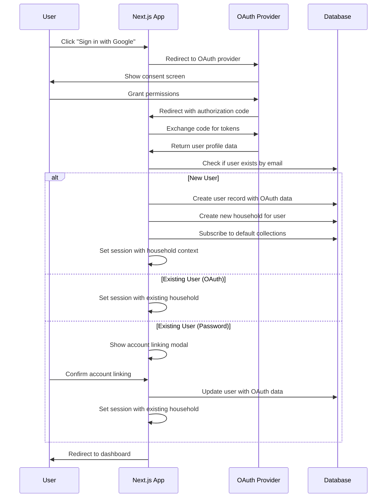

# User Registration & OAuth Integration Specification

## Executive Summary

This document outlines the implementation of OAuth-based user registration for the FamilyFoodie application, replacing traditional password authentication with Google and Facebook OAuth providers. The specification includes email-based household invitations, automatic household creation, and secure account linking workflows.

## Business Requirements

### Core Requirements
1. **OAuth Registration**: Users register using Google or Facebook accounts (no more passwords)
2. **Email Invitations**: Existing household members can invite others via email
3. **Signup When Invited**: When a user signs up via OAuth and already has a pending invitation, it takes them to that household
4. **Automatic Household Creation**: First-time users (who don't have an invitation) automatically get their own household
5. **Household Switching**: Users can switch between households when invited
6. **Orphaned Data Cleanup**: Automatic cleanup when households become empty
7. **Account Security**: Secure token-based invitation system with expiration

### User Stories

#### Registration Flow
- **As a new user**, I want to register with my Google account so I don't need to create another password
- **As a new user**, I want my own household automatically created so I can start using the app immediately
- **As a new user**, If I've been invited to a household, I want to be onboarded to that one and not a new household

#### Invitation Flow  
- **As a household member**, I want to invite family members via email so they can join our meal planning
- **As an invited user**, I want to receive an email with a secure link to join the household
- **As an invited user**, If I've signed up without using the link, I want the signup to recognise my email address and add me to the invited household

#### Household Management
- **As a user with invitations**, I want to see a list of invitations in the Settings panel (displays when I click my username) to review pending invitations
- **As the last user leaving a household**, I want the empty household and its data automatically cleaned up

## Technical Architecture

### OAuth Integration

#### Provider Selection: NextAuth.js (Auth.js v5)
NextAuth.js is the industry standard for OAuth in Next.js applications:
- **Built-in providers**: Google, Facebook, GitHub, etc.
- **Security**: PKCE, state validation, CSRF protection
- **Session management**: JWT tokens, database sessions
- **TypeScript support**: Full type safety

#### OAuth Providers Configuration

**Google OAuth Setup:**
```javascript
// next-auth.config.js
import Google from "next-auth/providers/google"

export const authConfig = {
  providers: [
    Google({
      clientId: process.env.GOOGLE_CLIENT_ID,
      clientSecret: process.env.GOOGLE_CLIENT_SECRET,
      authorization: {
        params: {
          scope: "openid email profile"
        }
      }
    })
  ]
}
```

**Facebook OAuth Setup:**
```javascript
import Facebook from "next-auth/providers/facebook"

Facebook({
  clientId: process.env.FACEBOOK_CLIENT_ID,
  clientSecret: process.env.FACEBOOK_CLIENT_SECRET,
  authorization: {
    params: {
      scope: "email"
    }
  }
})
```

**Required Environment Variables:**
```bash
# OAuth Providers
GOOGLE_CLIENT_ID=your_google_client_id
GOOGLE_CLIENT_SECRET=your_google_client_secret
FACEBOOK_CLIENT_ID=your_facebook_app_id
FACEBOOK_CLIENT_SECRET=your_facebook_app_secret

# NextAuth
NEXTAUTH_URL=http://localhost:3000
NEXTAUTH_SECRET=your_random_secret_key

# SendGrid Email Service
SENDGRID_API_KEY=your_sendgrid_api_key
SENDGRID_FROM_EMAIL=noreply@familyfoodie.com
```

### Database Schema Changes

#### Users Table Modifications

```sql
-- Add OAuth provider support
ALTER TABLE users ADD COLUMN oauth_provider VARCHAR(50) NULL COMMENT 'OAuth provider: google, facebook, etc.';
ALTER TABLE users ADD COLUMN oauth_provider_id VARCHAR(255) NULL COMMENT 'Provider-specific user ID';
ALTER TABLE users ADD COLUMN oauth_email VARCHAR(254) NULL COMMENT 'Email from OAuth provider';
ALTER TABLE users ADD COLUMN email_verified TINYINT(1) DEFAULT 0 COMMENT 'Email verification status';
ALTER TABLE users ADD COLUMN profile_image_url VARCHAR(500) NULL COMMENT 'Profile image from OAuth provider';

-- Make password optional (NULL for OAuth users)
ALTER TABLE users MODIFY COLUMN password VARCHAR(128) NULL COMMENT 'Password hash (NULL for OAuth users)';

-- Add performance indexes
ALTER TABLE users ADD INDEX idx_oauth_provider (oauth_provider);
ALTER TABLE users ADD INDEX idx_oauth_provider_id (oauth_provider_id);
ALTER TABLE users ADD INDEX idx_oauth_email (oauth_email);
ALTER TABLE users ADD INDEX idx_email_verified (email_verified);

-- Ensure unique OAuth accounts
ALTER TABLE users ADD UNIQUE KEY unique_oauth_user (oauth_provider, oauth_provider_id);

-- Ensure email uniqueness across all authentication methods
ALTER TABLE users ADD UNIQUE KEY unique_email (email);
```

#### Household Invitations Table

```sql
CREATE TABLE household_invitations (
    id INT AUTO_INCREMENT PRIMARY KEY,
    email VARCHAR(255) NOT NULL,
    household_id INT NOT NULL,
    invited_by_user_id INT NOT NULL,
    invite_token VARCHAR(255) NOT NULL UNIQUE,
    expires_at TIMESTAMP NOT NULL,
    created_at TIMESTAMP DEFAULT CURRENT_TIMESTAMP,
    accepted_at TIMESTAMP NULL,
    declined_at TIMESTAMP NULL,
    
    FOREIGN KEY (household_id) REFERENCES households(id) ON DELETE CASCADE,
    FOREIGN KEY (invited_by_user_id) REFERENCES users(id) ON DELETE CASCADE,
    
    INDEX idx_email (email),
    INDEX idx_household (household_id),
    INDEX idx_token (invite_token),
    INDEX idx_expires (expires_at),
    INDEX idx_invited_by (invited_by_user_id)
) ENGINE=InnoDB DEFAULT CHARSET=utf8mb4 COLLATE=utf8mb4_0900_ai_ci;
```

#### NextAuth Sessions Table (Optional)
```sql
-- If using database sessions instead of JWT
CREATE TABLE accounts (
    id INT AUTO_INCREMENT PRIMARY KEY,
    userId INT NOT NULL,
    type VARCHAR(255) NOT NULL,
    provider VARCHAR(255) NOT NULL,
    providerAccountId VARCHAR(255) NOT NULL,
    refresh_token TEXT,
    access_token TEXT,
    expires_at INT,
    token_type VARCHAR(255),
    scope VARCHAR(255),
    id_token TEXT,
    session_state VARCHAR(255),
    
    FOREIGN KEY (userId) REFERENCES users(id) ON DELETE CASCADE,
    UNIQUE KEY unique_provider_account (provider, providerAccountId)
) ENGINE=InnoDB DEFAULT CHARSET=utf8mb4 COLLATE=utf8mb4_0900_ai_ci;

CREATE TABLE sessions (
    id INT AUTO_INCREMENT PRIMARY KEY,
    sessionToken VARCHAR(255) NOT NULL UNIQUE,
    userId INT NOT NULL,
    expires TIMESTAMP NOT NULL,
    
    FOREIGN KEY (userId) REFERENCES users(id) ON DELETE CASCADE,
    INDEX idx_expires (expires)
) ENGINE=InnoDB DEFAULT CHARSET=utf8mb4 COLLATE=utf8mb4_0900_ai_ci;
```

### Email Integration with SendGrid

#### SendGrid Setup via Google Cloud Marketplace
1. **Google Cloud Console** → Marketplace → Search "SendGrid"
2. **Enable SendGrid API** and create API key
3. **Verify sender identity** (domain or single sender)
4. **Configure DNS records** for domain authentication (optional but recommended)

#### Email Service Implementation

```typescript
// src/lib/email/sendgrid.ts
import sgMail from '@sendgrid/mail';

sgMail.setApiKey(process.env.SENDGRID_API_KEY!);

export interface InvitationEmailData {
  recipientEmail: string;
  recipientName?: string;
  inviterName: string;
  householdName: string;
  inviteToken: string;
  expiresAt: Date;
}

export async function sendHouseholdInvitation(data: InvitationEmailData) {
  const inviteUrl = `${process.env.NEXTAUTH_URL}/auth/invite?token=${data.inviteToken}`;
  
  const msg = {
    to: data.recipientEmail,
    from: {
      email: process.env.SENDGRID_FROM_EMAIL!,
      name: 'Family Foodie'
    },
    templateId: 'd-invitation-template-id', // SendGrid dynamic template
    dynamicTemplateData: {
      recipientName: data.recipientName || data.recipientEmail,
      inviterName: data.inviterName,
      householdName: data.householdName,
      inviteUrl,
      expiresAt: data.expiresAt.toLocaleDateString(),
    }
  };

  try {
    await sgMail.send(msg);
    console.log('Invitation email sent successfully');
  } catch (error) {
    console.error('SendGrid error:', error);
    throw new Error('Failed to send invitation email');
  }
}

// Email template content for SendGrid dynamic template:
/*
Subject: You're invited to join {{inviterName}}'s Family Foodie household!

Hi {{recipientName}},

{{inviterName}} has invited you to join the "{{householdName}}" household on Family Foodie for shared meal planning and grocery lists.

[Join {{householdName}}]({{inviteUrl}})

This invitation expires on {{expiresAt}}.

Happy meal planning!
The Family Foodie Team
*/
```

### Registration & Authentication Workflows

#### New User Registration Flow



#### Account Linking Logic

```typescript
// src/lib/auth/account-linking.ts
export async function linkOAuthAccount(
  existingUserId: number,
  oauthProvider: string,
  oauthProviderId: string,
  oauthEmail: string,
  profileImageUrl?: string
) {
  const query = `
    UPDATE users 
    SET oauth_provider = ?, 
        oauth_provider_id = ?, 
        oauth_email = ?,
        profile_image_url = ?,
        email_verified = 1,
        updated_at = NOW()
    WHERE id = ?
  `;
  
  await pool.execute(query, [
    oauthProvider,
    oauthProviderId, 
    oauthEmail,
    profileImageUrl,
    existingUserId
  ]);
}

export async function findUserByEmail(email: string) {
  const query = `SELECT * FROM users WHERE email = ? OR oauth_email = ?`;
  const [rows] = await pool.execute(query, [email, email]);
  return rows[0];
}

export async function findUserByOAuthProvider(provider: string, providerId: string) {
  const query = `
    SELECT * FROM users 
    WHERE oauth_provider = ? AND oauth_provider_id = ?
  `;
  const [rows] = await pool.execute(query, [provider, providerId]);
  return rows[0];
}
```

### Household Invitation System

#### Invitation Management API

```typescript
// src/lib/invitations/manager.ts
import crypto from 'crypto';
import { sendHouseholdInvitation } from '@/lib/email/sendgrid';

export interface CreateInvitationParams {
  email: string;
  householdId: number;
  invitedByUserId: number;
  householdName: string;
  inviterName: string;
}

export async function createHouseholdInvitation(params: CreateInvitationParams) {
  // Generate secure random token
  const inviteToken = crypto.randomBytes(32).toString('hex');
  
  // Set expiration to 3 days from now
  const expiresAt = new Date(Date.now() + 3 * 24 * 60 * 60 * 1000);
  
  // Check if invitation already exists for this email/household
  const existingQuery = `
    SELECT id FROM household_invitations 
    WHERE email = ? AND household_id = ? AND expires_at > NOW() AND accepted_at IS NULL
  `;
  const [existing] = await pool.execute(existingQuery, [params.email, params.householdId]);
  
  if (existing.length > 0) {
    throw new Error('Invitation already pending for this email and household');
  }
  
  // Insert invitation record
  const insertQuery = `
    INSERT INTO household_invitations 
    (email, household_id, invited_by_user_id, invite_token, expires_at)
    VALUES (?, ?, ?, ?, ?)
  `;
  
  await pool.execute(insertQuery, [
    params.email,
    params.householdId,
    params.invitedByUserId,
    inviteToken,
    expiresAt
  ]);
  
  // Send invitation email
  await sendHouseholdInvitation({
    recipientEmail: params.email,
    inviterName: params.inviterName,
    householdName: params.householdName,
    inviteToken,
    expiresAt
  });
  
  return { inviteToken, expiresAt };
}

export async function validateInvitationToken(token: string) {
  const query = `
    SELECT hi.*, h.name as household_name, u.first_name as inviter_name
    FROM household_invitations hi
    JOIN households h ON hi.household_id = h.id
    JOIN users u ON hi.invited_by_user_id = u.id
    WHERE hi.invite_token = ? 
    AND hi.expires_at > NOW() 
    AND hi.accepted_at IS NULL 
    AND hi.declined_at IS NULL
  `;
  
  const [rows] = await pool.execute(query, [token]);
  return rows[0];
}

export async function acceptHouseholdInvitation(
  token: string,
  acceptingUserId: number
): Promise<{ switchedHousehold: boolean; oldHouseholdDeleted: boolean }> {
  const connection = await pool.getConnection();
  let switchedHousehold = false;
  let oldHouseholdDeleted = false;
  
  try {
    await connection.beginTransaction();
    
    // Validate invitation
    const invitation = await validateInvitationToken(token);
    if (!invitation) {
      throw new Error('Invalid or expired invitation');
    }
    
    // Get user's current household
    const [userRows] = await connection.execute(
      'SELECT household_id FROM users WHERE id = ?',
      [acceptingUserId]
    );
    const currentHouseholdId = userRows[0].household_id;
    
    // Check if user needs to switch households
    if (currentHouseholdId !== invitation.household_id) {
      switchedHousehold = true;
      
      // Check if user is the only member of their current household
      const [householdMemberCount] = await connection.execute(
        'SELECT COUNT(*) as count FROM users WHERE household_id = ?',
        [currentHouseholdId]
      );
      
      const isOnlyMember = householdMemberCount[0].count === 1;
      
      // Move user to new household
      await connection.execute(
        'UPDATE users SET household_id = ? WHERE id = ?',
        [invitation.household_id, acceptingUserId]
      );
      
      // If user was the only member, delete the old household
      if (isOnlyMember) {
        await deleteOrphanedHousehold(connection, currentHouseholdId);
        oldHouseholdDeleted = true;
      }
    }
    
    // Mark invitation as accepted
    await connection.execute(
      'UPDATE household_invitations SET accepted_at = NOW() WHERE invite_token = ?',
      [token]
    );
    
    await connection.commit();
    
    return { switchedHousehold, oldHouseholdDeleted };
    
  } catch (error) {
    await connection.rollback();
    throw error;
  } finally {
    connection.release();
  }
}

async function deleteOrphanedHousehold(connection: any, householdId: number) {
  // CASCADE DELETE will handle most cleanup through foreign key constraints
  // Collections, recipes, ingredients, plans, shopping_lists all CASCADE DELETE
  
  // Delete the household (cascading will clean up related data)
  await connection.execute('DELETE FROM households WHERE id = ?', [householdId]);
}
```

#### Pending Invitations Check

```typescript
// src/lib/invitations/pending.ts
export async function getPendingInvitations(userEmail: string) {
  const query = `
    SELECT hi.*, h.name as household_name, u.first_name as inviter_name
    FROM household_invitations hi
    JOIN households h ON hi.household_id = h.id
    JOIN users u ON hi.invited_by_user_id = u.id
    WHERE hi.email = ? 
    AND hi.expires_at > NOW() 
    AND hi.accepted_at IS NULL 
    AND hi.declined_at IS NULL
    ORDER BY hi.created_at DESC
  `;
  
  const [rows] = await pool.execute(query, [userEmail]);
  return rows;
}
```

### API Endpoints

#### Authentication Routes

```typescript
// src/app/api/auth/[...nextauth]/route.ts
import NextAuth from 'next-auth'
import { authConfig } from '@/lib/auth/config'

const handler = NextAuth(authConfig)

export { handler as GET, handler as POST }
```

#### Invitation Management Routes

```typescript
// src/app/api/invitations/send/route.ts
import { NextRequest, NextResponse } from 'next/server';
import { getServerSession } from 'next-auth';
import { createHouseholdInvitation } from '@/lib/invitations/manager';

export async function POST(request: NextRequest) {
  try {
    const session = await getServerSession();
    if (!session?.user?.household_id) {
      return NextResponse.json({ error: 'Unauthorized' }, { status: 401 });
    }
    
    const { email, householdName } = await request.json();
    
    if (!email || !householdName) {
      return NextResponse.json(
        { error: 'Email and household name are required' },
        { status: 400 }
      );
    }
    
    const result = await createHouseholdInvitation({
      email,
      householdId: session.user.household_id,
      invitedByUserId: session.user.id,
      householdName,
      inviterName: session.user.name
    });
    
    return NextResponse.json({ 
      success: true, 
      expiresAt: result.expiresAt 
    });
    
  } catch (error) {
    console.error('Send invitation error:', error);
    return NextResponse.json(
      { error: error.message || 'Failed to send invitation' },
      { status: 500 }
    );
  }
}
```

```typescript
// src/app/api/invitations/accept/route.ts
import { NextRequest, NextResponse } from 'next/server';
import { getServerSession } from 'next-auth';
import { acceptHouseholdInvitation } from '@/lib/invitations/manager';

export async function POST(request: NextRequest) {
  try {
    const session = await getServerSession();
    if (!session?.user?.id) {
      return NextResponse.json({ error: 'Unauthorized' }, { status: 401 });
    }
    
    const { token } = await request.json();
    
    const result = await acceptHouseholdInvitation(token, session.user.id);
    
    return NextResponse.json({
      success: true,
      switchedHousehold: result.switchedHousehold,
      oldHouseholdDeleted: result.oldHouseholdDeleted
    });
    
  } catch (error) {
    console.error('Accept invitation error:', error);
    return NextResponse.json(
      { error: error.message || 'Failed to accept invitation' },
      { status: 500 }
    );
  }
}
```

```typescript
// src/app/api/invitations/pending/route.ts
import { NextRequest, NextResponse } from 'next/server';
import { getServerSession } from 'next-auth';
import { getPendingInvitations } from '@/lib/invitations/pending';

export async function GET(request: NextRequest) {
  try {
    const session = await getServerSession();
    if (!session?.user?.email) {
      return NextResponse.json({ error: 'Unauthorized' }, { status: 401 });
    }
    
    const invitations = await getPendingInvitations(session.user.email);
    
    return NextResponse.json({ invitations });
    
  } catch (error) {
    console.error('Get pending invitations error:', error);
    return NextResponse.json(
      { error: 'Failed to get pending invitations' },
      { status: 500 }
    );
  }
}
```

### Frontend Components

#### OAuth Login Buttons

```typescript
// src/app/components/auth/LoginButtons.tsx
'use client';

import { signIn } from 'next-auth/react';
import { FcGoogle } from 'react-icons/fc';
import { SiFacebook } from 'react-icons/si';

export default function LoginButtons() {
  return (
    <div className="space-y-3">
      <button
        onClick={() => signIn('google', { callbackUrl: '/dashboard' })}
        className="w-full flex items-center justify-center gap-3 px-4 py-3 border border-gray-300 rounded-md bg-white text-gray-700 hover:bg-gray-50 transition-colors"
      >
        <FcGoogle size={20} />
        Continue with Google
      </button>
      
      <button
        onClick={() => signIn('facebook', { callbackUrl: '/dashboard' })}
        className="w-full flex items-center justify-center gap-3 px-4 py-3 border border-gray-300 rounded-md bg-blue-600 text-white hover:bg-blue-700 transition-colors"
      >
        <SiFacebook size={20} />
        Continue with Facebook
      </button>
    </div>
  );
}
```

#### Pending Invitations Modal

```typescript
// src/app/components/invitations/PendingInvitationsModal.tsx
'use client';

import { useState, useEffect } from 'react';
import { useSession } from 'next-auth/react';

interface PendingInvitation {
  id: number;
  household_name: string;
  inviter_name: string;
  invite_token: string;
  created_at: string;
}

export default function PendingInvitationsModal() {
  const { data: session } = useSession();
  const [invitations, setInvitations] = useState<PendingInvitation[]>([]);
  const [isOpen, setIsOpen] = useState(false);
  const [isLoading, setIsLoading] = useState(false);

  useEffect(() => {
    if (session?.user?.email) {
      checkPendingInvitations();
    }
  }, [session]);

  const checkPendingInvitations = async () => {
    try {
      const response = await fetch('/api/invitations/pending');
      if (response.ok) {
        const data = await response.json();
        if (data.invitations.length > 0) {
          setInvitations(data.invitations);
          setIsOpen(true);
        }
      }
    } catch (error) {
      console.error('Failed to check pending invitations:', error);
    }
  };

  const acceptInvitation = async (token: string) => {
    setIsLoading(true);
    try {
      const response = await fetch('/api/invitations/accept', {
        method: 'POST',
        headers: { 'Content-Type': 'application/json' },
        body: JSON.stringify({ token }),
      });

      if (response.ok) {
        const data = await response.json();
        if (data.success) {
          // Refresh the page to update session with new household
          window.location.reload();
        }
      } else {
        throw new Error('Failed to accept invitation');
      }
    } catch (error) {
      console.error('Error accepting invitation:', error);
      alert('Failed to accept invitation. Please try again.');
    } finally {
      setIsLoading(false);
    }
  };

  if (!isOpen || invitations.length === 0) return null;

  return (
    <div className="fixed inset-0 bg-black bg-opacity-50 flex items-center justify-center z-50">
      <div className="bg-white rounded-lg p-6 max-w-md w-full mx-4">
        <h2 className="text-xl font-semibold mb-4">Pending Household Invitations</h2>
        
        <p className="text-gray-600 mb-4">
          You've been invited to join the following households:
        </p>

        <div className="space-y-3 mb-6">
          {invitations.map((invitation) => (
            <div key={invitation.id} className="border border-gray-200 rounded-lg p-3">
              <h3 className="font-medium">{invitation.household_name}</h3>
              <p className="text-sm text-gray-600">
                Invited by {invitation.inviter_name}
              </p>
              <p className="text-xs text-gray-500 mb-2">
                {new Date(invitation.created_at).toLocaleDateString()}
              </p>
              
              <button
                onClick={() => acceptInvitation(invitation.invite_token)}
                disabled={isLoading}
                className="w-full bg-blue-600 text-white py-2 px-3 rounded text-sm hover:bg-blue-700 disabled:opacity-50"
              >
                {isLoading ? 'Accepting...' : 'Join Household'}
              </button>
            </div>
          ))}
        </div>

        <div className="flex justify-end">
          <button
            onClick={() => setIsOpen(false)}
            className="px-4 py-2 text-gray-600 hover:text-gray-800"
          >
            Maybe Later
          </button>
        </div>
      </div>
    </div>
  );
}
```

#### Invite Members Form

```typescript
// src/app/components/household/InviteMembersForm.tsx
'use client';

import { useState } from 'react';
import { useSession } from 'next-auth/react';

export default function InviteMembersForm() {
  const { data: session } = useSession();
  const [email, setEmail] = useState('');
  const [isLoading, setIsLoading] = useState(false);
  const [message, setMessage] = useState('');

  const sendInvitation = async (e: React.FormEvent) => {
    e.preventDefault();
    if (!email || !session?.user?.household_name) return;

    setIsLoading(true);
    setMessage('');

    try {
      const response = await fetch('/api/invitations/send', {
        method: 'POST',
        headers: { 'Content-Type': 'application/json' },
        body: JSON.stringify({
          email,
          householdName: session.user.household_name,
        }),
      });

      if (response.ok) {
        setMessage('Invitation sent successfully!');
        setEmail('');
      } else {
        const error = await response.json();
        throw new Error(error.error || 'Failed to send invitation');
      }
    } catch (error) {
      console.error('Send invitation error:', error);
      setMessage(`Error: ${error.message}`);
    } finally {
      setIsLoading(false);
    }
  };

  return (
    <div className="bg-white p-6 rounded-lg shadow">
      <h3 className="text-lg font-semibold mb-4">Invite Family Members</h3>
      
      <form onSubmit={sendInvitation}>
        <div className="mb-4">
          <label htmlFor="email" className="block text-sm font-medium mb-2">
            Email Address
          </label>
          <input
            type="email"
            id="email"
            value={email}
            onChange={(e) => setEmail(e.target.value)}
            placeholder="Enter email address"
            className="w-full px-3 py-2 border border-gray-300 rounded-md focus:outline-none focus:ring-2 focus:ring-blue-500"
            required
          />
        </div>

        <button
          type="submit"
          disabled={isLoading || !email}
          className="w-full bg-blue-600 text-white py-2 px-4 rounded-md hover:bg-blue-700 disabled:opacity-50 disabled:cursor-not-allowed"
        >
          {isLoading ? 'Sending...' : 'Send Invitation'}
        </button>
      </form>

      {message && (
        <div className={`mt-4 p-3 rounded ${
          message.includes('Error') ? 'bg-red-100 text-red-700' : 'bg-green-100 text-green-700'
        }`}>
          {message}
        </div>
      )}
    </div>
  );
}
```

### Security Considerations

#### OAuth Token Security
- **PKCE Flow**: NextAuth.js automatically implements PKCE for OAuth2 security
- **State Validation**: Prevents CSRF attacks during OAuth flows
- **Secure Session Storage**: JWT tokens stored in httpOnly cookies
- **Token Refresh**: Automatic refresh token handling

#### Invitation Token Security
- **Cryptographically Secure**: Generated using `crypto.randomBytes(32)`
- **Time-Limited**: 3-day expiration enforced at database level
- **Single Use**: Marked as accepted/declined after use
- **Rate Limiting**: Prevent spam invitations (implement in API routes)

#### Account Linking Security
- **Email Verification**: Only link accounts with verified email addresses
- **User Consent**: Show confirmation modal before linking accounts
- **Audit Trail**: Log account linking events for security monitoring

### Data Migration Strategy

#### Migration Script: OAuth Support

```sql
-- Migration: 008_add_oauth_support.sql

-- Add OAuth fields to users table
ALTER TABLE users ADD COLUMN oauth_provider VARCHAR(50) NULL;
ALTER TABLE users ADD COLUMN oauth_provider_id VARCHAR(255) NULL;
ALTER TABLE users ADD COLUMN oauth_email VARCHAR(254) NULL;
ALTER TABLE users ADD COLUMN email_verified TINYINT(1) DEFAULT 0;
ALTER TABLE users ADD COLUMN profile_image_url VARCHAR(500) NULL;

-- Make password optional for OAuth users
ALTER TABLE users MODIFY COLUMN password VARCHAR(128) NULL;

-- Add performance indexes
ALTER TABLE users ADD INDEX idx_oauth_provider (oauth_provider);
ALTER TABLE users ADD INDEX idx_oauth_provider_id (oauth_provider_id);
ALTER TABLE users ADD INDEX idx_oauth_email (oauth_email);
ALTER TABLE users ADD INDEX idx_email_verified (email_verified);

-- Add unique constraints
ALTER TABLE users ADD UNIQUE KEY unique_oauth_user (oauth_provider, oauth_provider_id);
ALTER TABLE users ADD UNIQUE KEY unique_email (email);

-- Create household invitations table
CREATE TABLE household_invitations (
    id INT AUTO_INCREMENT PRIMARY KEY,
    email VARCHAR(255) NOT NULL,
    household_id INT NOT NULL,
    invited_by_user_id INT NOT NULL,
    invite_token VARCHAR(255) NOT NULL UNIQUE,
    expires_at TIMESTAMP NOT NULL,
    created_at TIMESTAMP DEFAULT CURRENT_TIMESTAMP,
    accepted_at TIMESTAMP NULL,
    declined_at TIMESTAMP NULL,
    
    FOREIGN KEY (household_id) REFERENCES households(id) ON DELETE CASCADE,
    FOREIGN KEY (invited_by_user_id) REFERENCES users(id) ON DELETE CASCADE,
    
    INDEX idx_email (email),
    INDEX idx_household (household_id),
    INDEX idx_token (invite_token),
    INDEX idx_expires (expires_at),
    INDEX idx_invited_by (invited_by_user_id)
) ENGINE=InnoDB DEFAULT CHARSET=utf8mb4 COLLATE=utf8mb4_0900_ai_ci;

-- Mark existing users as email verified (they have passwords)
UPDATE users SET email_verified = 1 WHERE password IS NOT NULL;

-- Clean up expired invitations procedure
DELIMITER $$
CREATE EVENT cleanup_expired_invitations
    ON SCHEDULE EVERY 1 DAY
    DO
    BEGIN
        DELETE FROM household_invitations 
        WHERE expires_at < NOW() 
        AND accepted_at IS NULL 
        AND declined_at IS NULL;
    END$$
DELIMITER ;

-- Enable event scheduler
SET GLOBAL event_scheduler = ON;
```

### Testing Strategy

#### Unit Tests

```typescript
// __tests__/lib/invitations/manager.test.ts
import { createHouseholdInvitation, validateInvitationToken, acceptHouseholdInvitation } from '@/lib/invitations/manager';

describe('Invitation Manager', () => {
  test('should create valid invitation token', async () => {
    const params = {
      email: 'test@example.com',
      householdId: 1,
      invitedByUserId: 1,
      householdName: 'Test Household',
      inviterName: 'John Doe'
    };

    const result = await createHouseholdInvitation(params);
    
    expect(result.inviteToken).toHaveLength(64); // 32 bytes = 64 hex chars
    expect(result.expiresAt.getTime()).toBeGreaterThan(Date.now());
  });

  test('should reject duplicate invitations', async () => {
    // Test duplicate invitation prevention
  });

  test('should validate invitation tokens correctly', async () => {
    // Test token validation logic
  });

  test('should handle household switching on acceptance', async () => {
    // Test household switching and orphaned data cleanup
  });
});
```

#### Integration Tests

```typescript
// __tests__/api/invitations/send.test.ts
import { POST } from '@/app/api/invitations/send/route';
import { NextRequest } from 'next/server';

describe('/api/invitations/send', () => {
  test('should send invitation with valid session', async () => {
    // Mock authenticated session
    // Test invitation creation and email sending
  });

  test('should reject unauthenticated requests', async () => {
    // Test authentication requirement
  });
});
```

### Performance Considerations

#### Database Optimization
- **Indexes**: All foreign keys and search fields indexed
- **Connection Pooling**: Reuse database connections efficiently
- **Query Optimization**: Use prepared statements for all queries

#### Email Delivery
- **Async Processing**: Queue email sending for non-blocking responses
- **Error Handling**: Retry failed email sends with exponential backoff
- **Rate Limiting**: Prevent abuse of invitation system

### Monitoring & Analytics

#### Metrics to Track
- OAuth registration conversion rates
- Invitation acceptance rates  
- Household switching frequency
- Authentication errors and failures
- Email delivery success rates

#### Logging Requirements
- OAuth authentication events
- Account linking operations
- Invitation creation and acceptance
- Household switching events
- Failed authentication attempts

## Implementation Phases

### Phase 1: OAuth Infrastructure (Week 1)
- [ ] Set up NextAuth.js with Google and Facebook providers
- [ ] Configure OAuth applications and obtain API keys
- [ ] Update users table schema for OAuth support
- [ ] Implement account linking logic
- [ ] Create OAuth login components

### Phase 2: Email Invitation System (Week 2)
- [ ] Set up SendGrid integration via Google Cloud
- [ ] Create household_invitations table
- [ ] Implement invitation management API endpoints
- [ ] Build invitation email templates
- [ ] Create pending invitations modal

### Phase 3: Household Management (Week 3)
- [ ] Implement household switching logic
- [ ] Build orphaned data cleanup procedures
- [ ] Create household invitation UI components
- [ ] Add automatic household creation for new users
- [ ] Implement invitation token validation

### Phase 4: Testing & Security (Week 4)
- [ ] Write comprehensive unit and integration tests
- [ ] Implement rate limiting for invitation APIs
- [ ] Add security monitoring and logging
- [ ] Performance testing with concurrent users
- [ ] Security audit of OAuth and invitation flows

## Success Criteria

1. **OAuth Registration**: Users can register and login with Google/Facebook
2. **Automatic Households**: New users get their own household automatically
3. **Email Invitations**: Members can invite others via secure email links
4. **Household Switching**: Users can join different households when invited
5. **Data Cleanup**: Orphaned households are automatically cleaned up
6. **Account Linking**: Existing password users can link OAuth accounts
7. **Security**: All flows are secure with proper token validation
8. **Performance**: System handles concurrent registrations and invitations
9. **Monitoring**: Full visibility into authentication and invitation metrics

## Risk Assessment

| Risk | Probability | Impact | Mitigation |
|------|-------------|---------|------------|
| OAuth provider downtime | Low | Medium | Graceful error handling, fallback messaging |
| Email delivery failures | Medium | Medium | SendGrid SLA, retry logic, alternative providers |
| Invitation token security | Low | High | Cryptographic tokens, expiration, rate limiting |
| Household data conflicts | Low | High | Comprehensive testing, transaction rollbacks |
| User experience confusion | Medium | Medium | Clear UI flows, comprehensive documentation |

This OAuth-based registration system eliminates password security concerns while providing a seamless, modern authentication experience that integrates naturally with the existing household-based architecture.